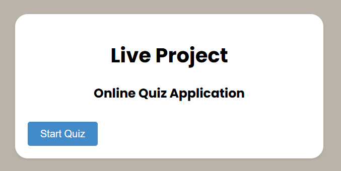
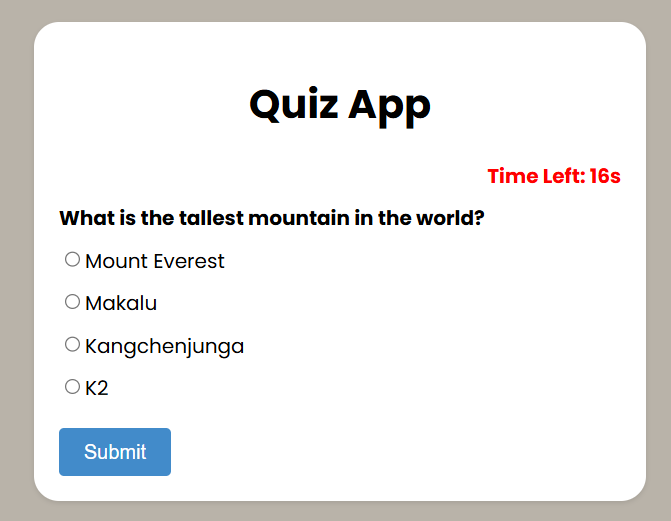
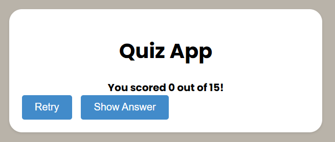

# 📝 Online Quiz Application

A simple and interactive quiz app built using HTML, CSS, and JavaScript. Users can answer multiple-choice questions, track their score, and review correct answers at the end. Each question has a 20-second timer to make the game more exciting!

## 🚀 Features

- Multiple-choice questions on various topics
- 20-second countdown timer for each question
- Instant scoring at the end of the quiz
- Option to retry the quiz
- Show correct answers for the ones you got wrong
- Clean and responsive user interface

## 📸 Preview
   MAIN WINDOW!
   
 


 QUIZ WINDOW!
 
 


RESULT WINDOW!

 


## 🛠️ Technologies Used

- HTML5
- CSS3
- JavaScript (Vanilla)

## 📂 How to Run

1. Clone this repository:
   ```bash
   
